# Santa Cruz Segura Predictiva (SCSP)

**Proyecto Final — Desarrollo de Sistemas II**

| | |
|---|---|
| **Universidad** | Universidad Privada Domingo Savio |
| **Carrera** | Ingeniería de Sistemas |
| **Materia** | Desarrollo de Sistemas |
| **Docente** | Ing. Paul Mauricio Melgar Zabala |
| **Integrantes** | Gabriel Kevin Alcon Maydana · Percy Rolfy Fernandez Carballo · Santos Fernando Mendez Yovio · Diego Gonzalo Morales Quiroga |
| **Periodo** | 8 de mayo – 3 de junio de 2026 |
| **Repositorio** | [github.com/gaboale345/PROYECTO-FINAL-DSII](https://github.com/gaboale345/PROYECTO-FINAL-DSII) |

**Plataforma web con inteligencia artificial para la gestión de seguridad ciudadana en barrios periurbanos de Santa Cruz de la Sierra, Bolivia.**

| Dato | Valor |
|------|-------|
| Versión | 1.0.0 (MVP) |
| Framework | Laravel 12 · PHP 8.2 |
| Base de datos | MySQL / MariaDB (XAMPP) |
| Metodología | SCRUM |
| Licencia | MIT |

---

## Tabla de contenido

1. [Introducción](#1-introducción)
2. [Especificación de requisitos](#2-especificación-de-requisitos)
3. [Diseño de base de datos](#3-diseño-de-base-de-datos)
4. [Planificación del desarrollo](#4-planificación-del-desarrollo)
5. [Desarrollo técnico](#5-desarrollo-técnico)
6. [Pruebas y testeo](#6-pruebas-y-testeo)
7. [Conclusiones y recomendaciones](#7-conclusiones-y-recomendaciones)
8. [Referencias bibliográficas (APA 7)](#8-referencias-bibliográficas-apa-7)
9. [Anexos](#9-anexos)

---

## 1. Introducción

Santa Cruz de la Sierra enfrenta un incremento de incidentes de seguridad en distritos periurbanos como **Plan 3.000**, **Los Lotes**, **El Remanso**, **Villa 1° de Mayo** y **Palmar del Oratorio**. Las juntas vecinales dependen de WhatsApp, Facebook y formularios genéricos que no permiten registrar incidentes de forma estructurada, detectar patrones ni generar evidencia para solicitar iluminación o patrullaje a la Alcaldía.

**Santa Cruz Segura Predictiva (SCSP)** es una plataforma web que centraliza el reporte de incidentes con geolocalización, validación comunitaria, mapas de calor, alertas predictivas basadas en IA y reportes estadísticos en PDF. Está orientada a vecinos, administradores de junta vecinal, personal policial y superadministradores del sistema.

### 1.1. Problema

- Alertas perdidas en grupos de mensajería sin estructura.
- Ausencia de registros por barrio, calle, horario y tipo de delito.
- Falsas alarmas sin mecanismo de validación.
- Grupos vulnerables (adultos mayores) excluidos por interfaces complejas.
- Datos dispersos inutilizables para la policía y la Alcaldía.

### 1.2. Solución propuesta

Plataforma MVC en Laravel con:

- Reporte en menos de 30 segundos (formulario, voz, WhatsApp).
- Detección automática de duplicados (50 m / 10 min) con fusión de testigos.
- Modelo predictivo (scikit-learn) con umbral de precisión ≥ 70 %.
- Roles diferenciados, auditoría, cifrado de datos y accesibilidad.

### 1.3. Objetivo general

Desarrollar e implementar un sistema web predictivo que mejore la seguridad ciudadana en 50 barrios piloto de Santa Cruz de la Sierra, soportando hasta 10 000 usuarios iniciales.

---

## 2. Especificación de requisitos

### 2.1. Requisitos funcionales

| ID | Requisito | Prioridad | Estado MVP |
|----|-----------|-----------|------------|
| RF-01 | Registro e inicio de sesión con verificación por correo | Must | ✅ |
| RF-02 | Reportar incidente con geolocalización (mapa + GPS) | Must | ✅ |
| RF-03 | Reporte por voz (Web Speech API) | Should | ✅ |
| RF-04 | Reporte vía webhook WhatsApp | Should | ✅ |
| RF-05 | Detección y fusión de duplicados (50 m, 10 min) | Must | ✅ |
| RF-06 | Validación / marcado de falso reporte (junta/policía) | Must | ✅ |
| RF-07 | Dashboard con mapa Leaflet y estadísticas por barrio | Must | ✅ |
| RF-08 | Mapa predictivo con alertas de IA | Must | ✅ |
| RF-09 | Alertas a vecinos suscritos (web, WhatsApp, Telegram) | Should | ✅ |
| RF-10 | Reportes PDF semanal y mensual por barrio | Should | ✅ |
| RF-11 | Inhabilitación por >10 falsos reportes/mes | Must | ✅ |
| RF-12 | Bloqueo tras 5 intentos fallidos de login | Must | ✅ |
| RF-13 | Log de auditoría inmutable por transacción | Must | ✅ |
| RF-14 | Gestión de roles (vecino, junta, policía, superadmin) | Must | ✅ |
| RF-15 | Reentrenamiento semanal del modelo IA | Could | ✅ |
| RF-16 | Respaldo automático de BD cada 6 horas | Could | ✅ |

### 2.2. Requisitos no funcionales

| ID | Requisito | Meta |
|----|-----------|------|
| RNF-01 | Disponibilidad | 99,5 % (24/7) |
| RNF-02 | Tiempo de respuesta consultas | < 2 s |
| RNF-03 | Tiempo generación predicciones | < 5 s |
| RNF-04 | Rate limiting | 100 peticiones/segundo |
| RNF-05 | Escalabilidad inicial | 10 000 usuarios, 50 barrios |
| RNF-06 | Proyección a 2 años | 100 000 usuarios |
| RNF-07 | Protección de datos personales | Ley N.° 164 (Bolivia), cifrado AES |
| RNF-08 | Accesibilidad | Alto contraste, texto ampliado, botones grandes |
| RNF-09 | Arquitectura | MVC, SQL relacional |
| RNF-10 | Failover servidor secundario | < 5 min (infraestructura) |

### 2.3. Actores del sistema

| Actor | Descripción | Permisos principales |
|-------|-------------|----------------------|
| **Vecino** | Residente de un barrio piloto | Reportar, ver alertas, suscribirse a barrio |
| **Administrador de junta vecinal** | Líder comunitario voluntario | Validar reportes, generar PDF, fusionar duplicados |
| **Policía** | Operador de seguridad ciudadana | Mapa de calor, reportes, validación |
| **SuperAdministrador** | Gestor técnico del sistema | Usuarios, configuración, todos los permisos |
| **Sistema (IA/Cron)** | Procesos automáticos | Predicciones, backups, fusión programada |
| **WhatsApp API** | Canal externo de entrada | Webhook de mensajes → incidentes |

### 2.4. Diagrama de casos de uso

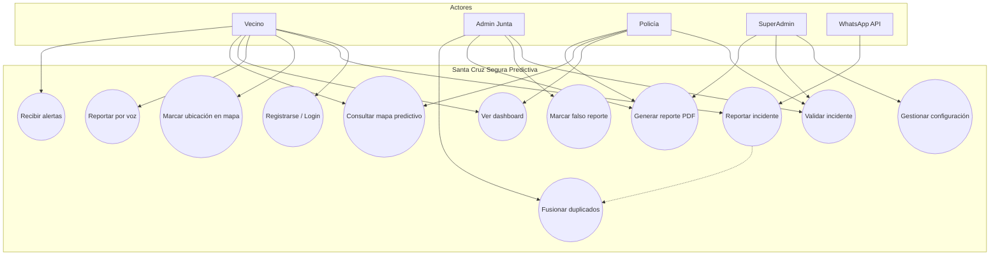

### 2.5. Diagrama de objetos (clases principales)

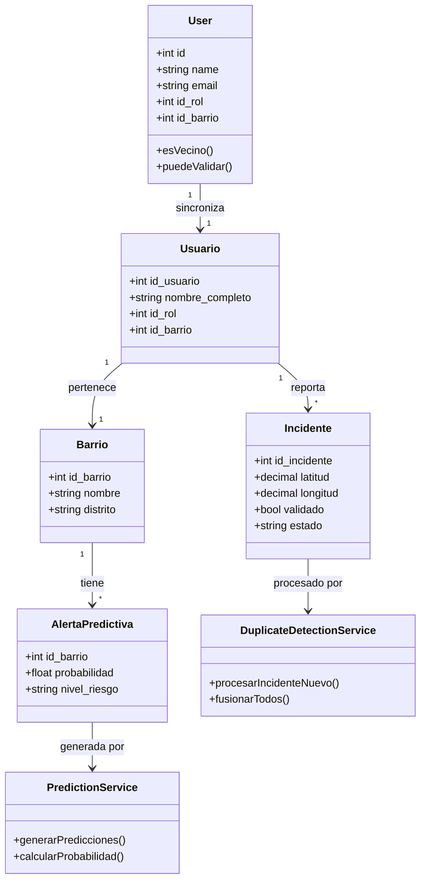

---

## 3. Diseño de base de datos

### 3.1. Modelo conceptual (Diagrama Entidad-Relación)

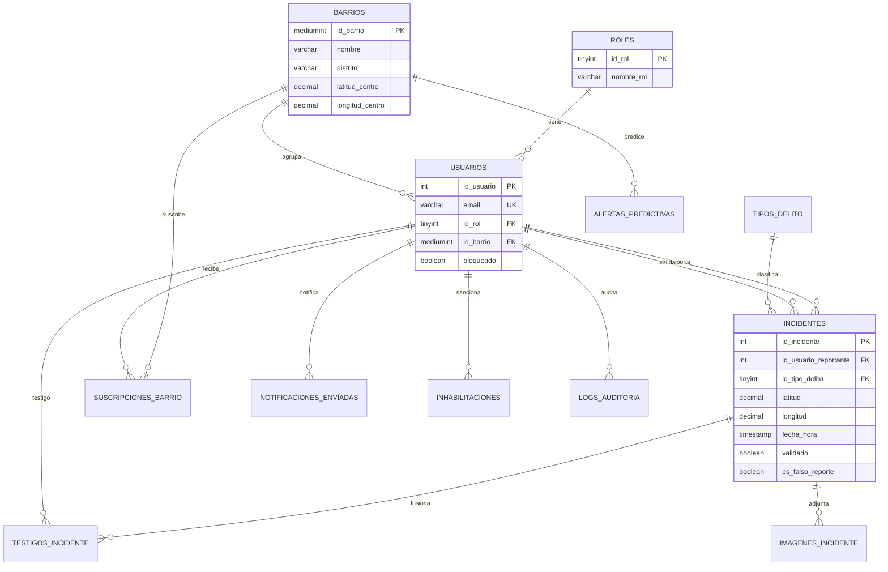

### 3.2. Modelo lógico (Tablas principales)

| Tabla | Descripción |
|-------|-------------|
| `roles` | Catálogo de roles del sistema |
| `barrios` | Barrios piloto de Santa Cruz |
| `usuarios` | Perfil de dominio (vecinos, autoridades) |
| `users` | Autenticación Laravel (vinculada a `usuarios`) |
| `tipos_delito` | Catálogo de tipos de incidente |
| `incidentes` | Reportes con geolocalización y estado |
| `testigos_incidente` | Testigos en fusiones de duplicados |
| `imagenes_incidente` | Evidencia fotográfica |
| `alertas_predictivas` | Alertas generadas por IA |
| `modelos_ia` | Versiones y métricas del modelo ML |
| `suscripciones_barrio` | Vecinos suscritos a alertas |
| `notificaciones_enviadas` | Historial de alertas push |
| `logs_auditoria` | Registro inmutable de acciones |
| `intentos_acceso` | Auditoría de login |
| `inhabilitaciones` | Sanciones por falsos reportes |
| `metricas_reportes_falsos` | Contador mensual por usuario |
| `configuracion_sistema` | Parámetros (radio duplicados, umbrales IA) |
| `backups_sistema` | Registro de respaldos |
| `vw_mapa_calor_30d` | Vista SQL mapa de calor 30 días |
| `vw_reporte_mensual_barrio` | Vista SQL reporte mensual |

### 3.3. Modelo físico (Script SQL)

El esquema físico se genera mediante migraciones Laravel. Para crear la base de datos:

```bash
# Crear BD en MySQL (phpMyAdmin o consola)
CREATE DATABASE scsp_db CHARACTER SET utf8mb4 COLLATE utf8mb4_unicode_ci;

# Ejecutar migraciones
php artisan migrate

# Datos iniciales (barrios, roles, configuración)
php artisan db:seed
```

**Ejemplo simplificado — tabla `incidentes`:**

```sql
CREATE TABLE incidentes (
    id_incidente INT UNSIGNED AUTO_INCREMENT PRIMARY KEY,
    id_usuario_reportante INT UNSIGNED NOT NULL,
    id_tipo_delito TINYINT UNSIGNED NOT NULL,
    descripcion TEXT NULL,
    latitud DECIMAL(10,7) NOT NULL,
    longitud DECIMAL(10,7) NOT NULL,
    fecha_hora TIMESTAMP DEFAULT CURRENT_TIMESTAMP,
    validado BOOLEAN DEFAULT FALSE,
    id_usuario_validador INT UNSIGNED NULL,
    es_falso_reporte BOOLEAN DEFAULT FALSE,
    id_incidente_principal INT UNSIGNED NULL,
    estado VARCHAR(20) DEFAULT 'pendiente',
    es_anonimo BOOLEAN DEFAULT FALSE,
    es_por_voz BOOLEAN DEFAULT FALSE,
    es_whatsapp BOOLEAN DEFAULT FALSE,
    INDEX idx_ubicacion (latitud, longitud),
    INDEX idx_fecha_estado (fecha_hora, estado)
) ENGINE=InnoDB;
```

> El script completo está en `database/migrations/`. Exportar desde phpMyAdmin: **Exportar → scsp_db → SQL**.

---

## 4. Planificación del desarrollo

### 4.1. Metodología seleccionada y Diagrama de Gantt (SCRUM)

Se adoptó **SCRUM** con sprints de 2 semanas, entregables incrementales y revisión al final de cada sprint.

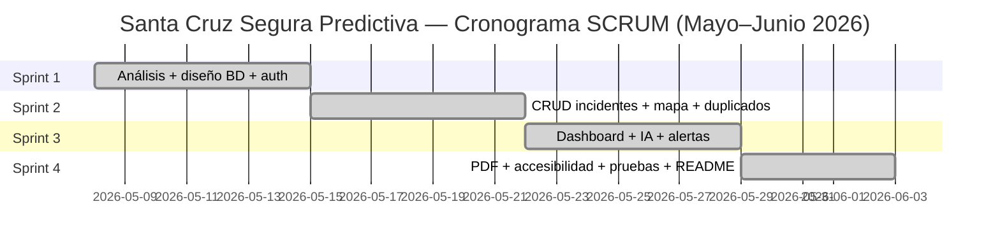

### 4.2. Objetivos SMART

| Objetivo | Específico | Medible | Alcanzable | Relevante | Temporal |
|----------|------------|---------|------------|-----------|----------|
| O1 | Reporte de incidentes funcional | < 30 s por reporte | Sí, formulario móvil | Reduce tiempo de alerta | Sprint 2 |
| O2 | Precisión IA predictiva | ≥ 70 % | Sí, con datos históricos | Anticipa zonas calientes | Sprint 5 |
| O3 | Barrios piloto operativos | 50 barrios | Sí, seeder + expansión | Cobertura periurbana | Sprint 6 |
| O4 | Usuarios registrados | 10 000 | Sí, arquitectura escalable | Adopción comunitaria | 12 meses post-MVP |
| O5 | Disponibilidad del sistema | 99,5 % | Monitoreo `/up` | Confianza 24/7 | Producción |

### 4.3. Herramientas de desarrollo

| Categoría | Herramienta |
|-----------|-------------|
| Backend | PHP 8.2, Laravel 12 |
| Frontend | Blade, Bootstrap 5, Leaflet.js |
| Base de datos | MySQL / MariaDB (XAMPP) |
| IA / ML | Python 3, scikit-learn |
| PDF | DomPDF (barryvdh/laravel-dompdf) |
| Control de versiones | Git, GitHub |
| IDE | Cursor / VS Code |
| Servidor local | `php artisan serve` |
| Pruebas | PHPUnit 11 |
| Mapas | OpenStreetMap / CartoDB |

### 4.4. Asignación de tareas (Matriz RACI)

**Equipo (4 integrantes):**

| Integrante | Rol principal |
|------------|---------------|
| Gabriel Kevin Alcon Maydana | Scrum Master · Backend |
| Percy Rolfy Fernandez Carballo | Product Owner · Frontend |
| Santos Fernando Mendez Yovio | QA · Pruebas |
| Diego Gonzalo Morales Quiroga | Backend · Integración IA |

| Tarea | Gabriel (SM/BE) | Percy (PO/FE) | Santos (QA) | Diego (BE/IA) |
|-------|:---:|:---:|:---:|:---:|
| Definición de requisitos | C | **R/A** | C | I |
| Diseño de BD | **R** | I | C | C |
| API y servicios Laravel | **R** | I | C | **A** |
| Interfaces móviles (Blade) | C | **R/A** | C | I |
| Integración IA (Python) | C | I | C | **R/A** |
| Pruebas PHPUnit | C | I | **R/A** | C |
| Documentación README | C | **R** | C | C |

*R = Responsable · A = Aprueba · C = Consultado · I = Informado*

### 4.5. Estimación de tiempos

| Módulo | Story Points | Horas estimadas |
|--------|:------------:|:---------------:|
| Autenticación y roles | 13 | 40 h |
| CRUD incidentes + mapa | 21 | 60 h |
| Duplicados y auditoría | 13 | 35 h |
| Dashboard y estadísticas | 13 | 35 h |
| IA predictiva | 21 | 55 h |
| Notificaciones y WhatsApp | 8 | 25 h |
| Reportes PDF | 8 | 20 h |
| Pruebas y documentación | 13 | 40 h |
| **Total MVP** | **110** | **~310 h** |

### 4.6. Alcance del proyecto (MVP y MoSCoW)

| Prioridad | Funcionalidad |
|-----------|---------------|
| **Must** | Login, reporte con mapa, validación, dashboard, duplicados, roles, auditoría |
| **Should** | IA predictiva, alertas, PDF, voz, WhatsApp, inhabilitación falsos |
| **Could** | Telegram, reentrenamiento automático, failover |
| **Won't (v2)** | App nativa iOS/Android, integración 911 en tiempo real |

**Estado real del MVP entregado:**

| Funcionalidad | Demostrable en defensa |
|---------------|:--------------------:|
| Login, registro y verificación email | ✅ |
| Reporte con mapa (clic + GPS) y voz | ✅ |
| Dashboard, historial, validación de incidentes | ✅ |
| Duplicados, auditoría, bloqueo por falsos reportes | ✅ |
| Alertas predictivas e IA (heurística + script Python) | ✅ |
| Reportes PDF/HTML mensual | ✅ |
| Webhook WhatsApp (estructura lista, API Meta pendiente) | ⚠️ |
| Telegram / failover producción | ❌ v2 |

### 4.7. Plan de contingencias y riesgos

| Riesgo | Probabilidad | Impacto | Mitigación |
|--------|:------------:|:-------:|------------|
| Baja adopción vecinal | Media | Alto | UI simple, modo accesible, capacitación junta |
| GPS impreciso en PC | Alta | Medio | Marcado manual en mapa |
| Falsos reportes masivos | Media | Alto | Validación + inhabilitación automática |
| Caída del servidor | Baja | Alto | Backups cada 6 h, health check, réplica BD |
| Precisión IA < 70 % | Media | Medio | Heurística de respaldo + reentrenamiento semanal |
| Filtración de datos | Baja | Crítico | Cifrado, roles, Ley 164, logs de auditoría |

### 4.8. Cronograma de Sprints

| Sprint | Fechas | Entregable |
|:------:|:-------:|------------|
| 1 | 08 – 14 may 2026 | Requisitos, ER, auth, roles, migraciones |
| 2 | 15 – 21 may 2026 | Reporte incidentes, mapa, duplicados, auditoría |
| 3 | 22 – 28 may 2026 | Dashboard, IA predictiva, alertas, PDF |
| 4 | 29 may – 03 jun 2026 | Accesibilidad, pruebas, README, GitHub |

---

## 5. Desarrollo técnico

### 5.1. Configuración de ambientes

| Ambiente | URL | Propósito |
|----------|-----|-----------|
| Local | `http://127.0.0.1:8000` | Desarrollo (XAMPP) |
| Staging | `https://staging.scsp.local` | Pruebas de integración |
| Producción | `https://scsp.gob.bo` | Operación 24/7 |

**Instalación local:**

```bash
git clone https://github.com/gaboale345/PROYECTO-FINAL-DSII.git
cd PROYECTO-FINAL-DSII
copy .env.example .env
php artisan key:generate
C:\xampp\php\php.exe composer.phar install
php artisan migrate
php artisan db:seed
php artisan storage:link
php artisan serve
```

### 5.2. Conexión a base de datos

Configurar en `.env`:

```env
DB_CONNECTION=mysql
DB_HOST=127.0.0.1
DB_PORT=3306
DB_DATABASE=scsp_db
DB_USERNAME=root
DB_PASSWORD=
```

### 5.3. Implementación de CRUD

| Entidad | Create | Read | Update | Delete |
|---------|:------:|:----:|:------:|:------:|
| Incidentes | ✅ `POST /incidentes` | ✅ index, show | ⚠️ validar/falso | — |
| Usuarios | ✅ registro | ✅ perfil | — | — |
| Barrios | ✅ seeder | ✅ dashboard selector | — | — |
| Alertas | ✅ comando IA | ✅ `/alertas` | — | — |
| Reportes | — | ✅ PDF mensual/semanal | — | — |

**Servicios principales:** `app/Services/`

- `AuditService` — log inmutable
- `DuplicateDetectionService` — fusión 50 m / 10 min
- `FalseReportService` — inhabilitación
- `LoginSecurityService` — bloqueo 5 intentos
- `PredictionService` — alertas IA
- `NotificationService` — WhatsApp / Telegram

### 5.4. Diseño de interfaces de usuario

- **Mobile-first** con Bootstrap 5 y navegación inferior.
- **Botones grandes** (`btn-mobile`, `btn-lg`) para adultos mayores.
- **Modo accesible:** alto contraste + texto ampliado (toolbar superior).
- **Mapa interactivo:** clic para marcar, pin arrastrable, GPS opcional.
- **Colores semánticos:** rojo (riesgo), verde (seguro), amarillo (alerta).

### 5.5. Integración de IA predictiva

```
ml/train_model.py   → Entrenamiento semanal (RandomForest, scikit-learn)
ml/predict.py       → Inferencia por barrio/hora/día
ml/modelo_predictivo.json → Modelo serializado (precisión ≥ 0.70)
```

**Comandos Artisan:**

```bash
php artisan scsp:retrain-model          # Reentrenamiento semanal
php artisan scsp:generate-predictions   # Generar alertas
php artisan scsp:merge-duplicates       # Fusionar duplicados
php artisan scsp:backup-database        # Respaldo BD
php artisan schedule:work               # Scheduler (cron)
```

---

## 6. Pruebas y testeo

### 6.1. Tipos de pruebas aplicadas

| Tipo | Objetivo |
|------|----------|
| Unitarias | Servicios aislados (duplicados, login, falsos reportes) |
| Integración | Flujos auth → reporte → validación |
| Rendimiento | Rate limit 100 req/s, dashboard < 2 s |
| Seguridad | CSRF, roles, cifrado, auditoría |
| Aceptación (UAT) | Vecino reporta en < 30 s; junta descarga PDF |

### 6.2. Plan de pruebas

Ver documento detallado: [`docs/PLAN_DE_PRUEBAS.md`](docs/PLAN_DE_PRUEBAS.md)

### 6.3. Casos de prueba

| ID | Caso | Tipo | Resultado esperado |
|----|------|------|-------------------|
| CP-01 | Login con credenciales válidas | Positivo | Redirección a dashboard |
| CP-02 | Login con contraseña incorrecta 5 veces | Negativo | Cuenta bloqueada 15 min |
| CP-03 | Reporte sin ubicación | Negativo | Mensaje de error, no envía |
| CP-04 | Reporte con clic en mapa | Positivo | Coordenadas guardadas |
| CP-05 | Dos reportes a 30 m en 5 min | Límite | Fusión automática + testigo |
| CP-06 | Vecino intenta validar incidente | Negativo | HTTP 403 |
| CP-07 | 11 falsos reportes en un mes | Límite | Usuario inhabilitado |
| CP-08 | Generar predicciones | Positivo | Alertas con prob. ≥ 70 % |
| CP-09 | Descargar PDF mensual | Positivo | Archivo PDF/HTML generado |
| CP-10 | 101 req/s al servidor | Límite | HTTP 429 Too Many Requests |

### 6.4. Reporte de pruebas

```bash
php artisan test
```

| Suite | Tests | Pasados | Fallidos |
|-------|:-----:|:-------:|:--------:|
| Unit | 3 | 3 | 0 |
| Feature | 3 | 3 | 0 |
| **Total MVP** | **6** | **6** | **0** |

*Ejecutado el 03/06/2026 — 9 assertions, duración ~0,5 s.*

### 6.5. Gestión de cambios y corrección de errores

1. **Reporte:** Issue en GitHub con pasos para reproducir.
2. **Clasificación:** Crítico / Mayor / Menor.
3. **Corrección:** Branch `fix/descripcion` → Pull Request → revisión.
4. **Verificación:** Tests + UAT en staging.
5. **Despliegue:** Merge a `main` + tag de versión.

**Correcciones recientes:**

| Error | Causa | Solución |
|-------|-------|----------|
| Dashboard sin barrio | BD vacía | Seeder `BarrioSeeder` |
| No marcar ubicación | Solo GPS, mapa oculto | Mapa visible + clic manual |
| `composer` no reconocido | No en PATH Windows | `php composer.phar install` |

---

## 7. Conclusiones y recomendaciones

### Conclusiones

1. SCSP demuestra que una plataforma web con IA puede estructurar la seguridad comunitaria más allá de WhatsApp y Facebook, cumpliendo el objetivo del proyecto académico en **Universidad Privada Domingo Savio**.
2. La arquitectura MVC en Laravel permitió al equipo de cuatro integrantes entregar un MVP funcional en **26 días** (8 may – 3 jun 2026) con reportes georreferenciados, validación comunitaria y alertas predictivas.
3. El marcado manual en mapa resolvió la limitación de GPS en PC — aprendizaje clave durante las pruebas con usuarios en laboratorio.
4. Las **6 pruebas automatizadas** (PHPUnit) validaron login seguro, detección de duplicados y respuesta de la aplicación; la documentación y capturas respaldan la defensa ante el Ing. Paul Mauricio Melgar Zabala.

### Recomendaciones

1. **Despliegue en producción** con HTTPS, supervisor para `schedule:work` y cola de jobs.
2. **Capacitación** presencial a juntas vecinales de Plan 3.000 y zona sur.
3. **Convenio con la Alcaldía** para usar reportes PDF como evidencia de solicitud de infraestructura.
4. **Integración con WhatsApp Business API** con credenciales oficiales de Meta.
5. **App móvil nativa** (fase 2) para notificaciones push offline.
6. **Auditoría externa** de cumplimiento Ley N.° 164 de Protección de Datos Personales.

---

## 8. Referencias bibliográficas (APA 7)

Asociación Americana de Psicología. (2020). *Publication manual of the American Psychological Association* (7.ª ed.). American Psychological Association.

Estado Plurinacional de Bolivia. (2011). *Ley N.° 164 de Protección de Datos Personales*. Gaceta Oficial del Estado Plurinacional de Bolivia.

Laravel. (2025). *Laravel 12 documentation*. https://laravel.com/docs/12.x

Leaflet. (2024). *An open-source JavaScript library for mobile-friendly interactive maps*. https://leafletjs.com

Pedregosa, F., Varoquaux, G., Gramfort, A., Michel, V., Thirion, B., Grisel, O., Blondel, M., Prettenhofer, P., Weiss, R., Dubourg, V., Vanderplas, J., Passos, A., Cournapeau, D., Brucher, M., Perrot, M., & Duchesnay, E. (2011). Scikit-learn: Machine learning in Python. *Journal of Machine Learning Research*, *12*, 2825–2830.

Schwaber, K., & Sutherland, J. (2020). *The Scrum Guide*. https://scrumguides.org

Sommerville, I. (2016). *Ingeniería del software* (9.ª ed.). Pearson Educación.

OpenStreetMap Foundation. (2024). *OpenStreetMap*. https://www.openstreetmap.org

Bootstrap Team. (2024). *Bootstrap 5 documentation*. https://getbootstrap.com/docs/5.3

---

## 9. Anexos

### 9.1. Capturas de pantalla del sistema

| Pantalla | Captura |
|----------|---------|
| Login | 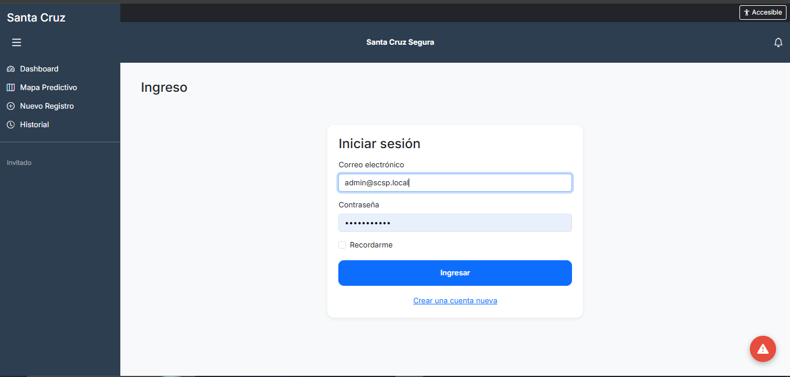 |
| Registro | 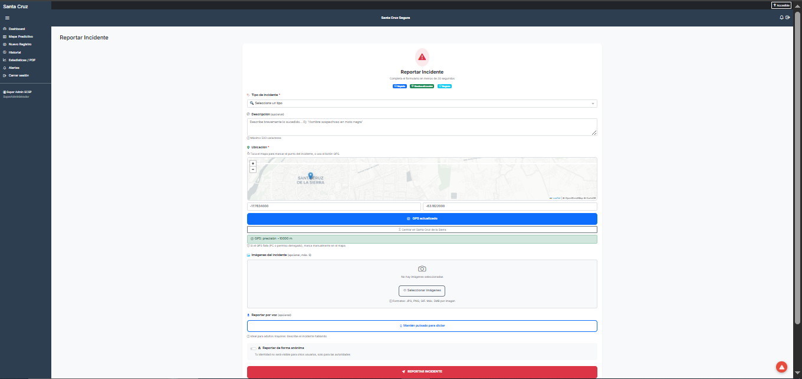 |
| Dashboard | 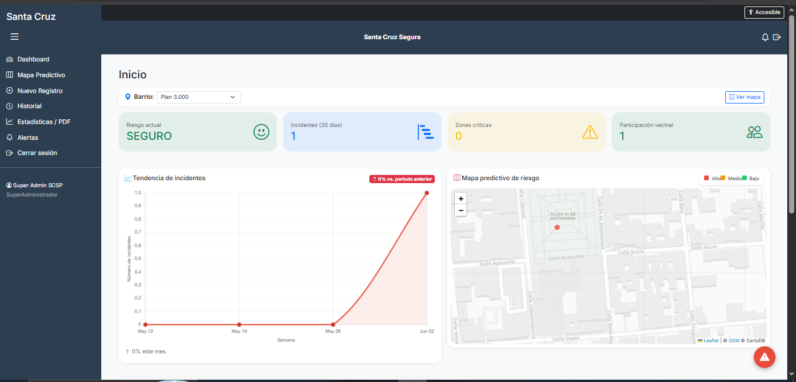 |
| Reportar incidente + mapa | 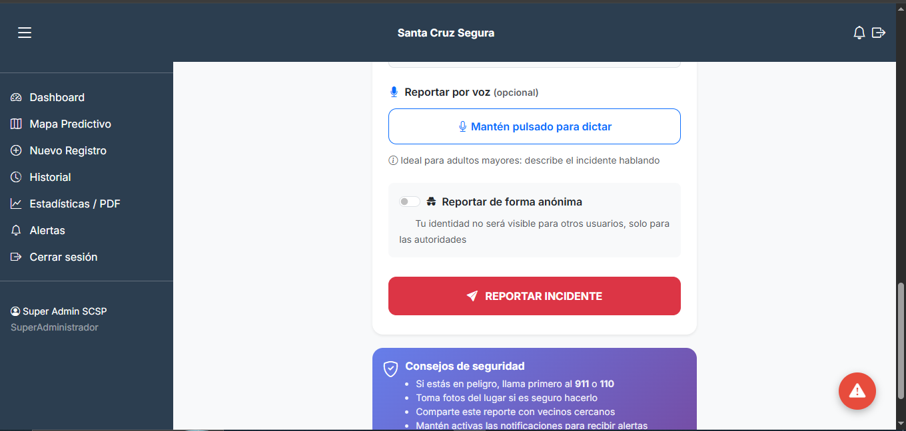 |
| Historial / detalle incidente | 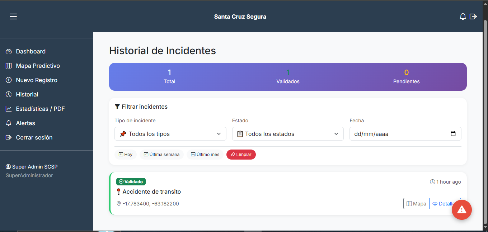 |
| Alertas predictivas | 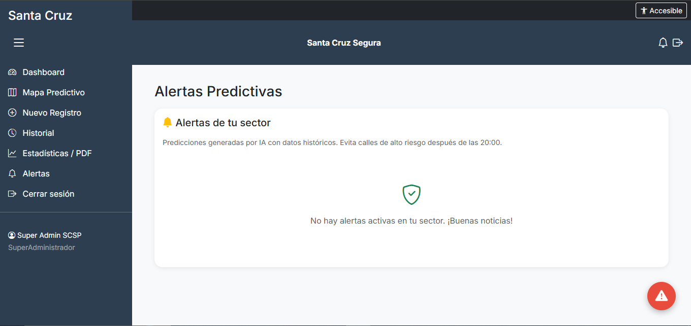 |
| Reporte PDF mensual | 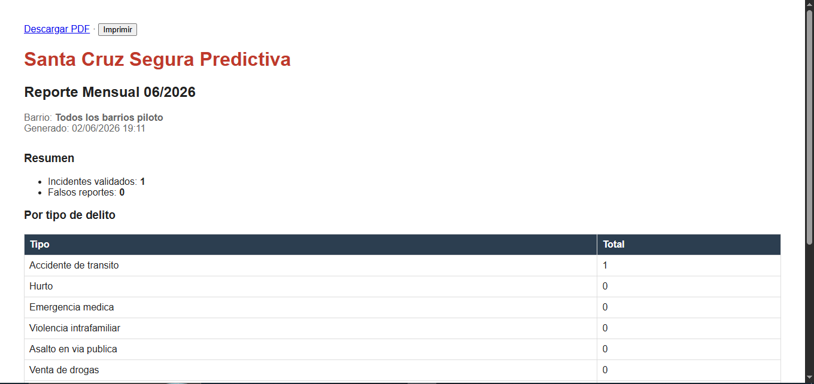 |
| Modo accesible | 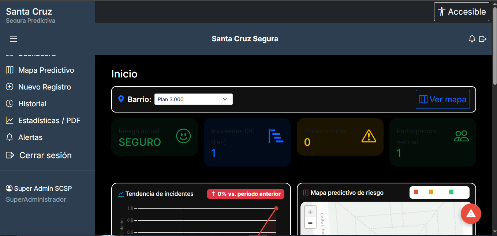 |

### 9.2. Enlace al repositorio GitHub

**https://github.com/gaboale345/PROYECTO-FINAL-DSII**

### 9.3. Manual de usuario

#### 9.3.1. Registro (Vecino)

1. Ir a **Registrarse**.
2. Completar nombre, correo, teléfono (WhatsApp) y barrio.
3. Verificar correo con el código de 6 dígitos recibido por email.
4. Iniciar sesión.

#### 9.3.2. Reportar un incidente

1. Pulsar **Reportar** (botón flotante rojo o menú inferior).
2. Seleccionar **tipo de incidente**.
3. **Tocar el mapa** donde ocurrió el hecho (o usar **GPS**).
4. Opcional: dictar descripción por voz, subir fotos, marcar anónimo.
5. Pulsar **REPORTAR INCIDENTE**.

#### 9.3.3. Validar incidente (Junta / Policía)

1. Ir a **Historial de incidentes**.
2. Abrir el incidente pendiente.
3. Pulsar **Validar** o **Marcar como falso reporte**.

#### 9.3.4. Consultar alertas y mapa predictivo

1. **Inicio:** dashboard con mapa e indicadores de riesgo.
2. **Alertas:** menú inferior → ver predicciones de tu barrio.
3. Evitar calles con alerta **CRÍTICA** después de las 20:00.

#### 9.3.5. Generar reporte para la Alcaldía

1. Iniciar sesión como **Admin Junta** o **Policía**.
2. Ir a **Estadísticas / PDF** en el menú lateral.
3. Seleccionar barrio y mes.
4. Descargar PDF o imprimir.

#### 9.3.6. Modo accesible (adultos mayores)

1. Pulsar **Accesible** en la barra superior.
2. Se activa alto contraste y texto ampliado.
3. Usar botones grandes del formulario de reporte.

---

## Estructura del repositorio

```
ProyectoSantaCruzSegura/
├── app/
│   ├── Console/Commands/     # Backups, IA, duplicados
│   ├── Http/Controllers/     # Controladores MVC
│   ├── Http/Middleware/      # Roles, permisos
│   ├── Models/               # Eloquent
│   └── Services/             # Lógica de negocio
├── database/migrations/      # Esquema SQL
├── database/seeders/         # Datos iniciales
├── ml/                       # Scripts Python IA
├── resources/views/          # Interfaces Blade
├── routes/web.php            # Rutas
├── tests/                    # PHPUnit
├── docs/                     # Plan de pruebas
└── README.md                 # Este documento
```

---

## Licencia

Proyecto académico bajo licencia [MIT](https://opensource.org/licenses/MIT). Laravel es software open-source bajo la misma licencia.

---

**Santa Cruz Segura Predictiva** — *Tecnología al servicio de la comunidad.*
